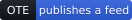

# Badges

Static SVGs, served from `https://opentechevents.org/badge/`. Hand-written, no service behind
them: they keep rendering if shields.io is down, and they never phone home about who is reading
your README. If you need another wording (a translated one, or "consumes OTE"), open an issue —
the files are ~10 lines each.

| Badge | Use it if | File |
| --- | --- | --- |
|  | You publish an OTE feed and want a "subscribe" button, RSS-style | `ote-feed.svg` |
|  | Same, but you're out of horizontal space — a nav bar, a table cell, a mobile footer | `ote-feed-icon.svg` |
|  | You back the spec, consume it, or plan to adopt it | `ote-supporter.svg` |

## The feed badge: link it to your feed, not to opentechevents.org

This is the one meant to be clicked, the same way an RSS icon is: it must take the visitor
straight to something that resolves — your OTE feed itself, `https://your-domain/events.json`,
not a page about OTE. Point it anywhere else and it stops working as a subscribe button.

Markdown:

```markdown
[](https://your-domain.example/events.json)
```

HTML:

```html
<a href="https://your-domain.example/events.json"></a>
```

Tight on space (nav bar, table row, mobile footer)? Use the icon-only variant instead, same rule
for the link:

```html
<a href="https://your-domain.example/events.json"></a>
```

Nobody checks whether the link is real before you publish it. If you wear the badge, please make
sure it points at a feed that actually resolves — a badge that lies is worse than no badge.

## The supporter badge

This one is a merit badge, not a subscribe button: it links to the project, not to a feed you
publish.

Markdown:

```markdown
[](https://opentechevents.org#support)
```

HTML:

```html
<a href="https://opentechevents.org#support"></a>
```
